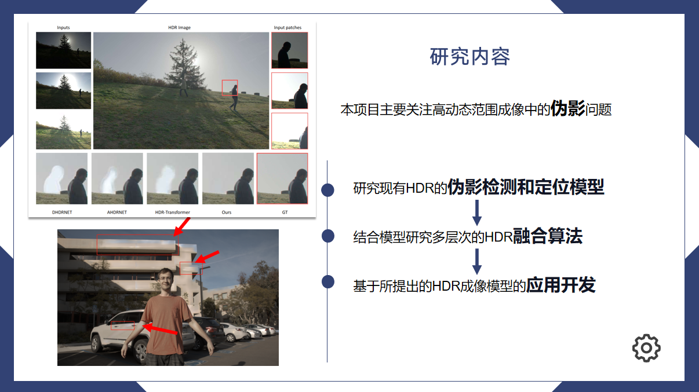








Hi there! My name is Hang Wu (吴杭), you can also call me by my English name Laurent.

I am currently a senior student majoring in Software Engineering at Tongji University. My main research interests are in vision-language models and large multimodal models, with a focus on improving their performance and specific applications. During my undergraduate studies, I also worked on image processing tasks in the low-level vision field.

During my undergraduate studies, I had the privilege of joining Ni's group at the School of Computer Science and Technology, Tongji University, as a research intern. Under Prof. [Zhangkai Ni](https://eezkni.github.io/)'s mentorship, I focused on research in the low-level vision field, primarily image processing and High Dynamic Range (HDR) reconstruction. Recently, I joined the UC Merced NLP Lab as a research intern, where I am working under the mentorship of Prof. [Yiwei Wang](https://wangywust.github.io/) on vision-language models.

You can find my CV here: [Hang Wu's Curriculum Vitae](https://drive.google.com/file/d/1tjqro_JbiiftOFt2t6EiVHtf3ulZTjbL/view?usp=drive_link). If you are interested in my work, please feel free to drop me an email.

# 🔥 News
- *2025.03*: Join Vivo as an assistant NLP engineer!
- *2024.11*: One paper submitted to CVPR 2025!
<!-- - *2024.11*: &nbsp;🎉🎉 One paper submitted to CVPR 2025! -->

# 📝 Publications 
Coming soon...

<!-- 

CVPR 2016

[Deep Residual Learning for Image Recognition](https://openaccess.thecvf.com/content_cvpr_2016/papers/He_Deep_Residual_Learning_CVPR_2016_paper.pdf)

**Kaiming He**, Xiangyu Zhang, Shaoqing Ren, Jian Sun -->

<!-- [**Project**](https://scholar.google.com/citations?view_op=view_citation&hl=zh-CN&user=DhtAFkwAAAAJ&citation_for_view=DhtAFkwAAAAJ:ALROH1vI_8AC) <strong></strong>
- Lorem ipsum dolor sit amet, consectetur adipiscing elit. Vivamus ornare aliquet ipsum, ac tempus justo dapibus sit amet. 

- [Lorem ipsum dolor sit amet, consectetur adipiscing elit. Vivamus ornare aliquet ipsum, ac tempus justo dapibus sit amet](https://github.com), A, B, C, **CVPR 2020** -->

# 🎖 Honors and Awards
- *2022.09* Scholarship for Outstanding Students, Tongji University.

# 📖 Educations
- *2021.09 - Present*,  Undergraduate student, Tongji University.

<!-- 
# 💬 Invited Talks
- *2021.06*, Lorem ipsum dolor sit amet, consectetur adipiscing elit. Vivamus ornare aliquet ipsum, ac tempus justo dapibus sit amet. 
- *2021.03*, Lorem ipsum dolor sit amet, consectetur adipiscing elit. Vivamus ornare aliquet ipsum, ac tempus justo dapibus sit amet.  \| [\[video\]](https://github.com/) -->

# 📚 Projects 

[Research on Perception-oriented High Dynamic Range Imaging Systems]()

[**Project**]() | <strong>National-level Innovation Project</strong>
-  We treat artifacts in HDR images as detectable entities, explicitly detect and suppress them to enhance HDR quality.
-  National-level innovation project at Tongji University, with a funding of 10,000 RMB.

# 💻 Internships
- *2025.03 - Present*, Assistant NLP Engineer, Vivo@Shenzhen, China.
- *2025.01 - Present*, Research Intern, UC Merced NLP Lab@University of California-Merced, Remote.
- *2023.09 - 2025.03*, Research Intern, Ni's Group@Tongji University, Shanghai, China.